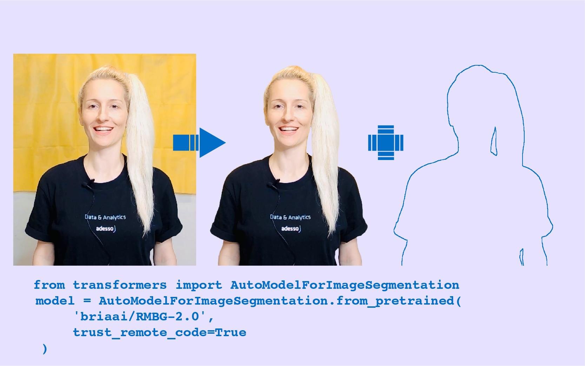
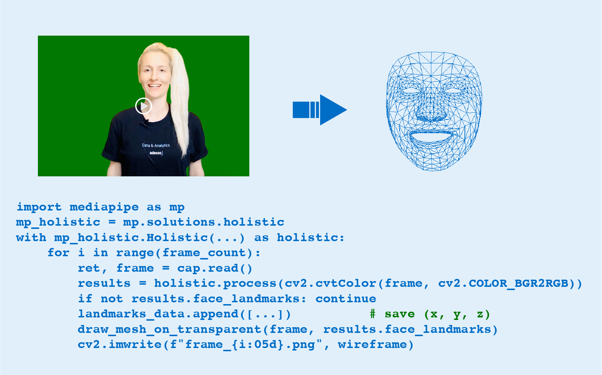
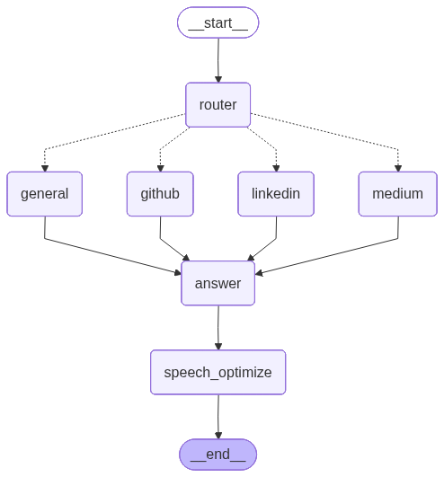
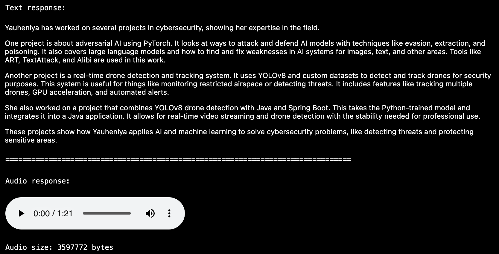

# Digital Twin Frontend

A fun interactive demo created for colleagues in the Data & Analytics (DNA) department at adesso SE. As new colleagues, we were invited to submit a creative video presentation with a max length of 40 seconds introducing ourselves. Being an AI engineer, I added some AI elements to my video presentation and built this web interface to make it interactive.

## Demo

✨ **Live Demo**: [https://yauheniya-adesso.github.io/digital-twin](https://yauheniya-adesso.github.io/digital-twin)

## AI Components

This project demonstrates several AI techniques working together:

### 1. Portrait Matting

    
   <strong>Figure 1: Background removal using rmbg-2.0 model</strong>

 Used the pretrained **rmbg-2.0 model** from Hugging Face to remove the background and extract the body outline. This creates the moving avatar for the digital twin. Before finding this model, I experimented with several other portrait matting solutions including MODNet and rembg, but none of them preserved fine details like hair strands or achieved the high-quality edge definition needed for a professional result. 

### 2. Wireframe Face Animation

    
   <strong>Figure 2: Real-time face tracking using MediaPipe </strong>

 Implemented face tracking using **OpenCV and MediaPipe** to make the digital twin follow lip and face movements when talking, creating a more lifelike interaction. This was achieved by processing a pre-recorded video, which makes the implementation straightforward and efficient. MediaPipe detects facial landmarks (478 key points on the face) in real-time, while OpenCV handles video frame processing and rendering, allowing the wireframe to accurately track facial expressions and mouth movements frame by frame.

### 3. Agentic AI System

    
   <strong>Figure 3: Multi-agent RAG system with intelligent routing</strong>

 Built a multi-agent AI system using **LangGraph** that:
- Intelligently routes questions to appropriate data sources (LinkedIn, GitHub, Medium)
- Uses Retrieval-Augmented Generation (RAG) with vector search for accurate responses
- Handles multi-language queries with automatic translation to English
- Optimizes answers for natural text-to-speech output

See the [backend repository](https://github.com/yauheniya-adesso/digital-twin-backend) for technical details.

### 4. Text-to-Speech (TTS)

    
   <strong>Figure 4: Voice synthesis using Coqui TTS</strong>

 Integrated a pretrained **Coqui TTS model** from Hugging Face to give voice to the digital twin, enabling natural spoken responses. The digital twin was originally designed to provide audio output, and the local model successfully generates voice responses. However, due to deployment constraints on platforms like Render and Hugging Face Spaces, the current live demo returns text-only responses. The full audio functionality remains available when running the backend locally.

## Features

**Interactive Chat Interface** - Ask questions about my professional background and projects  
**Mobile-Optimized** - Responsive design for QR code access  
**Smart Suggestions** - Rotating placeholder questions to guide users  
**Voice Responses** - Text-to-speech output for accessibility (when enabled)

##  Monitoring

The system integrates with LangSmith for complete observability:

- Query routing decisions
- Context retrieval results
- LLM prompts and responses
- Token usage and latency
- Error tracking

## Technology Stack

**Frontend:**  
-  React 18

**Backend:**
-  LangGraph (multi-agent orchestration)
-  LangSmith (monitoring)
-  OpenAI GPT-4 (language model)
- ChromaDB (vector store)
- Coqui TTS (text-to-speech)
-  FastAPI (REST API)

**Deployment:**
-  GitHub Pages (frontend)
-  Hugging Face Spaces (backend)

## Future Enhancements

**Advanced Voice Cloning & Facial Animation:**
- Record a video sample with voice to capture authentic wireframe movements and facial expressions
- Clone my voice using state-of-the-art voice synthesis models for a personalized speech pattern
- Synchronize the digital twin's lip movements and facial animations with the cloned voice in real-time
- Replicate my typical speaking mannerisms and facial expressions for a more natural interaction

**Infrastructure Improvements:**
- Migrate backend to a platform that supports hosting custom voice models
- Enable real-time streaming of voice responses for lower latency
- Implement GPU acceleration for faster speech synthesis

## Acknowledgements

- **Animated DNA Background** – Custom CSS animation representing the DNA department DNA Strand 🧬 from Konstantin Denerz @[CodePen](https://codepen.io/konstantindenerz/pen/ExJZPZO)  
- **Portrain Matting** – [briaai/RMBG-2.0](https://huggingface.co/briaai/RMBG-2.0)
- **Audio Output** – [coqui-ai/TTS](https://github.com/coqui-ai/TTS)

## License

MIT